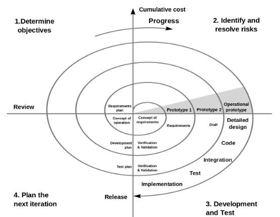

# Development Methodologies

There are several high level methodologies that have been tested over time. Each has a purpose - for example, the “waterfall” process is useful when the solution is low volume and high risk, such as a rocket launch. Many times, though, we use a mixture of methods. Consider the rocket - though we have just a single launch, we can perform integration testing of many subsystems, such as the engine, to better guarantee success. The engine may be developed using an agile approach (see below) if we have the resources to test multiple iterations.

## Waterfall

In the waterfall method, we step linearly through the engineering process, mimicking a waterfall:

{ width="400" }

/// caption
Waterfall design process.
///

This generally necessitates much more rigor on the front-end: requirements and the design must be much more meticulous to avoid issues in the implementation and delivery.

A related design method for software is the V model, where various stages of development correspond with different testing methods.

/// caption
V development model.
///

Further reading: 

- <https://en.wikipedia.org/wiki/Waterfall_model>
- <https://www.umsl.edu/~hugheyd/is6840/waterfall.html>
- <https://en.wikipedia.org/wiki/V-Model_(software_development)>

## Spiral

In contrast to the waterfall approach above, the spiral method is meant to support more iteration. The benefits to this approach are that the process is more adaptable to unknowns in the requirements and, because the process is less front-heavy, the time between project kickoff and visible results is much shorter.

The spiral process tends to focus on areas of high risk. In our robotics competitions this might be sections of the design that are unknown - a mechanism that must deal with a strange new game element, for example. A focus on “de-risking” ensures we can catch challenging design aspects early-on, providing the most time to resolve them.

/// caption
Spiral appraoch to the engineering process.
///

Further reading:

- <https://en.wikipedia.org/wiki/Spiral_model>

## Agile

The agile method was primarily developed for software, though it can be adapted to any engineering discipline. Agile focuses on customer interaction, which requires getting working prototypes in place early in the process. Typically, the project is broken down such that a working prototype can be developed within a fixed unit of time called a “sprint” (commonly 2 weeks but can be any length). 

Customer feedback is included in the sprint, creating a process that more easily guarantees the project remains on track to deliver the correct solution. This solves a common issue in other methodologies where the customer may not be in a position to evaluate the fitness of the solution until significant effort has been expended.

/// caption
Agile methodology showing multiple, shorter sprints, essentially a faster version of the spiral design process.
///

Further reading:

- Agile manifesto: <http://agilemanifesto.org/>
- Scrum: <https://www.atlassian.com/agile/scrum>

## Cross-Functional Product Teams

A common technique employed by larger companies is the cross-functional product team. In this hierarchy, there are still functional departments such as electrical, mechanical, and software engineering. However, individual projects require knowledge from multiple departments. A matrix is formed connecting individuals within a department to one or more product teams. In this way, departments can be optimally utilized across all active projects.

In FRC, product teams during the build season could be “drivetrain”, “endgame”, or “game piece indexing”. Individuals would sign up or be assigned to a particular product team and work with other departments to bring that element to completion.

Further reading:

- <https://medium.com/neemz-product/collaborating-effectively-in-cross-functional-product-team-settings-5e08ee6057b8>

