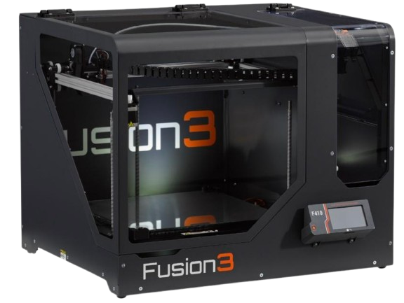
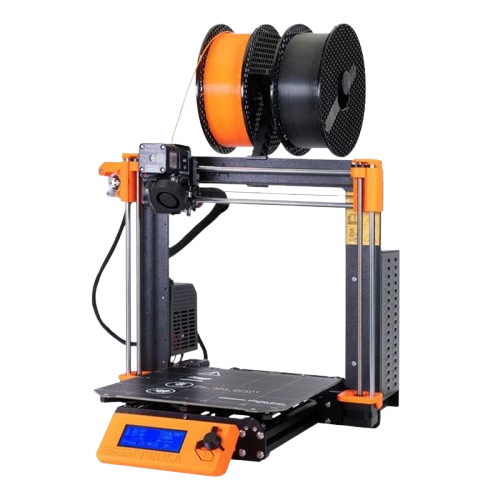
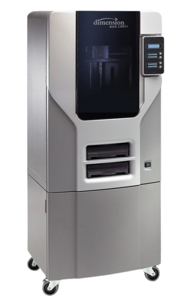
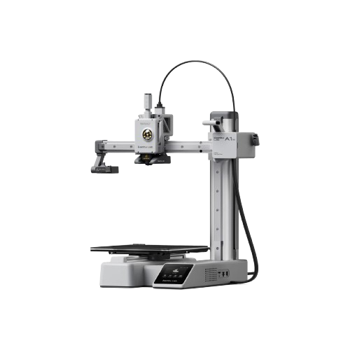
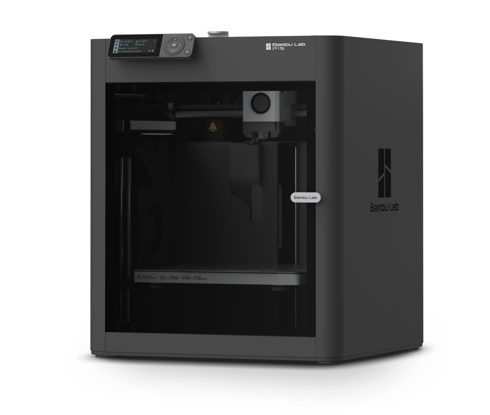
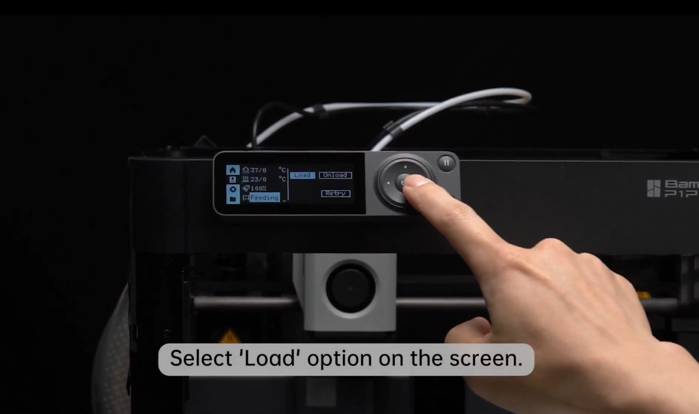

# 3D Printer

## About

BambuLab P1S
Our 3D printing setup includes a range of FDM printers to suit different materials, part sizes, and print requirements. While we have a Prusa MK4, Fusion3 F410, and Stratasys Dimension 1200es for specialized tasks, we recommend using our Bambu Lab printers—the A1 Mini and P1S—for most prints due to their speed, reliability, and excellent print quality.

| { width=350px } | { width=250px } | {width=80px} | { width=350px } | { width=250px } |
|:---:|:---:|:---:|:---:|:---:|
| Fusion3 410 | Prusa MK4 | Stratasys Dimension 1200es | BambuLab A1 Mini | BambuLab P1S |

This guide will be primarily focused on the Bambu Lab ecosystem, but similar principles hold true for the other platforms.

!!! warning 
    As of the 2025 FRC season, we are sponsored by Polymaker, a filament company. As a part of this sponsorship, we are required to use their filaments on all 3D printed parts on our competition season robot. 
## Setup

### Filaments 

| Filament | Strength     | Flexibility | Print Temp | Bed Temp | Adhesion                   | Notes                                                                 |
|----------|--------------|-------------|------------|----------|----------------------------|-----------------------------------------------------------------------|
| PLA| Moderate| Low| 190–220°C  | 50–60°C  | Excellent on PEI| Easy to print, biodegradable, low heat resistance|
| PETG| High| Medium| 230–250°C  | 70–85°C  | Good (best on textured PEI)| Strong, slightly flexible, can stick too well to smooth PEI|
| ABS| High| Medium| 230–250°C  | 90–110°C | Fair (needs enclosure)| Strong, durable, warps without enclosure|
| TPU| Medium| Very High| 220–240°C| 30–60°C| Good on textured PEI| Flexible, elastic, needs slower speeds|
| ASA| High| Medium| 240–260°C| 90–110°C | Moderate| UV and weather-resistant, similar to ABS|
| Nylon| Very High| High| 240–260°C | 70–90°C | Poor (use glue stick) | Strong and durable, absorbs moisture quickly|

### Load Filament

1. Select the "Load" Button
   
    { width=350px }

2. Follow Instructions on Screen to Complete the Process

### Selecting a Plate

!!! tip 
    We usually recommend using a Textured PEI Plate, but Smooth PEI Plates have their benefits.

| Feature| Smooth PEI| Textured PEI|
|--------------------------|--------------------------------------------------|--------------------------------------------------|
| Bottom layer finish| Glossy| Matte/textured                                   |
| Ideal materials| PLA, ABS| PETG, TPU, PLA                                   |
| Adhesion strength| Very high (can over-stick with PETG)| Moderate to high, easier release|
| Durability| Can scratch easily| Highly durable|
| Cleaning requirements    | Frequent (alcohol, dish soap)| Less frequent, more forgiving|
| Ease of part removal| Can be difficult| Usually easy once cooled|
| Surface consistency| Uniform and smooth| Textured |

## Usage

You can use either [Bambu Studio](https://bambulab.com/en/download/studio) or [OrcaSlicer](https://github.com/SoftFever/OrcaSlicer) to prepare print files. Both are compatible with Bambu Lab printers and support cloud and local network printing.

!!! note 
    Ask Kevin or a Manager for our Bambu Lab account details

1. Import your model.    
2. Choose your filament and build plate type.
3. Adjust print settings.
4. Slice the model.
5. Send to printer.

!!! tip 
    You can enable timelapse to record a video of your print for prosperity! 

## Troubleshooting

| Issue | Action |
| ----- | ------ |
| Clogged Hotend | [Bambu Lab Wiki](https://wiki.bambulab.com/en/x1/troubleshooting/nozzle-clog) | 

## Machine-Specific Safety Guidelines

3D printer hazards include, but are not limited to:

- The generation of ultrafine/nano-sized particles;
- Heat;
- Mechanical hazards from moving parts;
- High voltage;
- Ultraviolet light; and
- Chemical vapors (ex. styrene, acrylonitrile, or formaldehyde, etc.) depending on the media being used.

There are a variety of printing materials available for use with 3D printers, each with its own inherent hazards. The most commonly used materials are PLA, ABS, PETG, and Nylon. In general PLA, PP and PET-G are much safer to use than ABS and Nylon.

Safety Guidelines adapted from [RIT's 3D Printer Safety](https://www.rit.edu/ehs/3-d-printer-safety) guide.