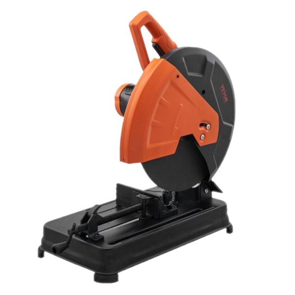

# Abrasive Saw

{ align="right" width="200px" }

## About

An abrasive saw, or cut-off saw, uses a high-speed rotating abrasive wheel to cut hard materials like metal, tile, and masonry. Unlike toothed saws, it grinds rather than cuts, generating high friction and heat.

## Setup

- Use an abrasive wheel suitable for the material being cut (e.g., metal, stone). Our saw is set up for cutting steel.
- Check for cracks or damage and ensure it is properly installed, secured, and not worn down completely.
- Clamp the workpiece firmly to prevent movement or shifting during the cut. The slide has a quick release to speed up the process.
- Make sure the saw is powered.

## Usage

- Power on the saw and let the wheel reach full speed before starting the cut.
- Lower the wheel to the workpiece at a controlled, steady pace.
- Allow the wheel to cut naturally - do not force it, as this can overheat or damage the wheel.
- Be cautious of flying sparks; position yourself and others away from the spark path.
- Release pressure on the saw, turn it off, and wait for the wheel to come to a complete stop before moving the workpiece.

!!! warning "Safety Note"
    Parts cut on the saw are **HOT!** :fire: Do not immediately touch small parts or places close to the cutting area without cooling the part with water. Use pliers or appropriate gloves to handle the part if it is hot, or wait for it to cool before handling.

## Cleanup

- Sweep or vacuum any metal shavings, dust, and debris around the saw area.
- Check the wheel for wear, damage, and clean as necessary for the next user.
- Return any used accessories or tools to their designated storage.

## Troubleshooting

| Issue | Action |
| ----- | ------ |
| Blade binds or stalls | Ensure the material is clamped firmly and avoid applying excessive pressure. |
| Excessive sparks or heat | Check the condition of the wheel, and avoid cutting too quickly. Use a suitable cutting wheel for the material. |
| Vibration or unstable cuts | Verify the wheel is balanced and securely mounted, and make sure the workpiece is tightly clamped. |
| Not cutting through completely | Check that the wheel is not worn out, and that the material is steel. Aluminum can smear and "gum up" the blade. |

## Safety Guidelines

| Symbol | Description |
| ------ | ----------- |
| { width="40px" } | Closed-Toe Shoes   **Required** |
| { width="40px" } | Eye Protection   **Required** |
| { width="40px" } | Hearing Protection   **As Needed** |
| { width="40px" } | Tie Back Long Hair / Loose Clothes   **Required** |
| { width="40px" } | **Do NOT**   Wear Gloves! |

- Always clamp the material securely to prevent movement during the cut.
- Parts are hot! Do not handle immediately without gloves or pliers, and use a water basin (or time) to cool.
- Keep hands and body parts clear of the wheel's path and avoid direct exposure to sparks.
- Wait for the wheel to come to a complete stop before moving the material or making adjustments.
