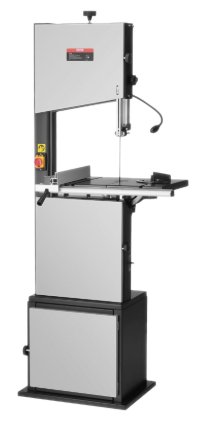

# Bandsaw

{ align="right" width="150px" }

## About

The band saw is used to quickly cut through medium and small aluminum parts. It is composed of a stand, blade, adjustable guide post, table, fence, and power buttons.

## Setup

- Adjust guide post so it is roughly 1/2in. above the part, to keep the band as stiff as possible.
- If using a fence or guide, adjust the position and angle.

## Usage

- Make sure the part is not in contact with the blade when starting.
- Press the green power button to start the band saw.
- Slowly push the part through the blade, adjusting the angle as needed to correct for blade drift.
- Press the red stop button when finished.

## Cleanup

- Sweep or vacuum chips and debris for the next user.
- Return fence / guide to original location.

## Troubleshooting

| Issue | Action |
| ----- | ------ |
| Blade stops moving | Stop machine and back blade out of cut.     Ensure part is pushed straight through the blade and not shifted left/right or twisted. Do not push the part too quickly, or the motor may stall. |
| Blade wanders or twists | Ensure the bearing guides above and below the table are pushed gently up against the blade. |
| Blade snaps | The blade is worn out and must be replaced. |

## Safety Guidelines

| Symbol | Description |
| ------ | ----------- |
| { width="40px" } | Closed-Toe Shoes   **Required** |
| { width="40px" } | Eye Protection   **Required** |
| { width="40px" } | Hearing Protection   **As Needed** |
| { width="40px" } | Tie Back Long Hair / Loose Clothes   **Required** |
| { width="40px" } | **Do NOT**   Wear Gloves! |

- Hold the part tightly.
- Hold the part sufficiently far from the blade. Use pliers for very small parts, or clamp to a guide.
- Part may be hot! Wait for it to cool before handling. Hold at least 1-2 inches from the blade to prevent heat build-up.
- Keep hands away from the blade while the machine is powered.
- Wait for all motion to cease before grabbing cutoff pieces.
- When cutting long material, ensure the area is clear and others in vicinity are aware.
