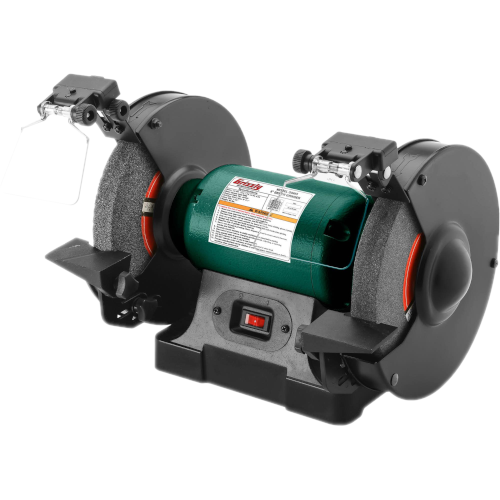

# Bench Grinder

{ align="right" width="200px" }

## About

A grinder is a powerful tool used to grind, shape, or finish metals and other hard materials. It can be used for removing excess material, smoothing edges, or sharpening tools. Common types include angle grinders, bench grinders, and die grinders.

## Setup

- Choose a grinding wheel or disc suitable for the material and task (e.g., grinding wheel, flap disc, or cut-off wheel).
- Ensure the wheel is free from cracks or damage and is properly secured.
- Set tool rests 1/8" from the wheel to prevent workpiece snagging.
- For angle and die grinders, secure the workpiece firmly. For bench grinders, ensure your grip is steady.

## Usage

- Power on the grinder and allow the wheel to reach full speed before use.
- Gently bring the workpiece to the grinder. Do not force or press too hard; let the grinder do the work.
- Keep consistent pressure, allowing the wheel to remove material gradually.
- Be cautious of overheating, especially when grinding metal, as it can warp or damage the material. Cool the workpiece with water if needed.

## Cleanup

- Wait for the wheel to stop fully before unplugging or handling the grinder.
- Sweep or vacuum any grinding dust and metal shavings.
- Return any used tools or wheels to their designated storage area.

## Troubleshooting

| Issue | Action |
| ----- | ------ |
| Wheel stalls or binds | Check that the material isn’t too thick for the grinder and ensure the wheel is not damaged or dull. |
| Excessive vibration | Ensure the wheel is securely mounted and balanced. |
| Overheating | Reduce pressure on the workpiece or apply cooling fluid to avoid material damage. |

## Safety Guidelines

| Symbol | Description |
| ------ | ----------- |
| { width="40px" } | Closed-Toe Shoes   **Required** |
| { width="40px" } | Eye Protection   **Required** |
| { width="40px" } | Hearing Protection   **As Needed** |
| { width="40px" } | Tie Back Long Hair / Loose Clothes   **Required** |

- Material must be stable, especially when using an angle or die grinder.
- Confirm that the wheel is undamaged and appropriate for the material.
- Keep hands and body clear of the wheel while the machine is in use.
- Wait for the wheel to stop completely before setting the grinder down or changing accessories.
