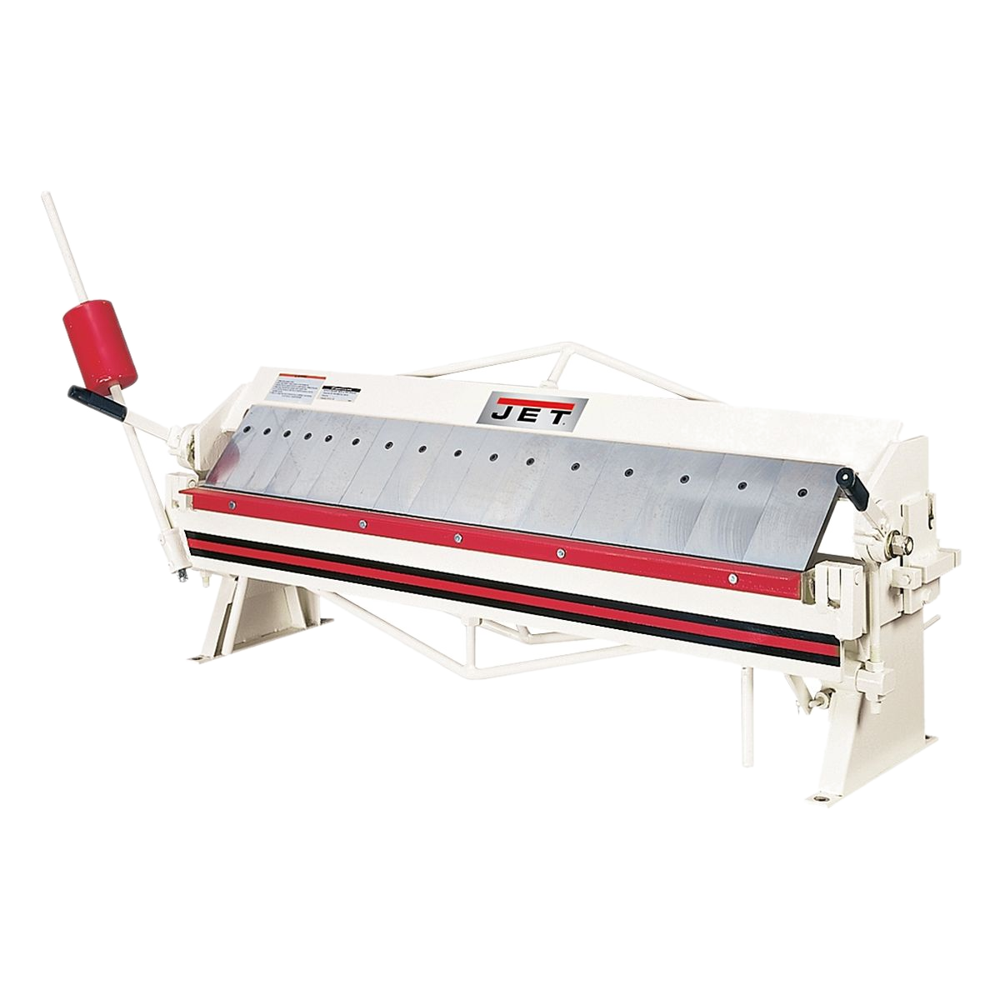

# Brake

{ align="right" width="250px" }

## About

A brake is a machine used to bend sheet metal into precise shapes and angles. Common types include box and pan brakes, press brakes, and hydraulic brakes. It’s ideal for creating bends, hems, and other forms in sheet metal.

## Setup

- Choose the appropriate die or finger configuration based on the desired bend or box shape.
- Reset the machine by leveling the bed and opening the clamp.
- Place the metal sheet against the back gauge or alignment guides to ensure a straight, accurate bend.
- Ensure the material and tooling are aligned and clear of obstructions.

## Usage

- Clamp the sheet metal in place.
- For manual brakes, use the lever or handle to apply pressure. For hydraulic or press brakes, engage the power to start the bend.
- Apply steady pressure until the desired bend angle is achieved. Avoid jerking or forcing the material, which can result in misalignment. Many materials are elastic or "springy" and require bends beyond the desired angle. This is required more for plastics and thinner materials.
- Release pressure and remove the workpiece. Check for accuracy in angle and alignment.

## Cleanup

- Replace an clamps that were removed or adjusted.

## Troubleshooting

| Issue | Action |
| ----- | ------ |
| Uneven bends | Check that the material is positioned straight and secured properly. |
| Material slips | Ensure the clamping mechanism is tight, or apply a slight adjustment to the clamping pressure. Make sure the material is not too thick, and the desired bend is not within a tenth of an inch from a previous bend. |
| Excessive force needed | Confirm the material thickness is within the machine’s capacity, or check for any misalignment or obstruction. |

## Safety Guidelines

| Symbol | Description |
| ------ | ----------- |
| { width="40px" } | Closed-Toe Shoes   **Required** |
| { width="40px" } | Eye Protection   **Required** |
| { width="40px" } | Hearing Protection   **As Needed** |
| { width="40px" } | Tie Back Long Hair / Loose Clothes   **Required** |

- Always ensure the material is clamped or securely held in place.
- Do not exceed the brake’s material thickness or width capacity.
- Keep hands and body parts clear of the bending area to avoid pinching or crushing injuries.
- Wait for all movement to stop before repositioning the material or adjusting the machine.
