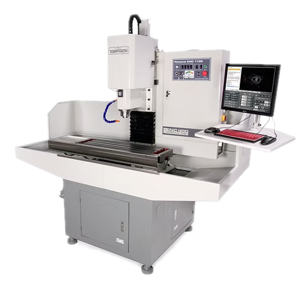

# CNC Mill

{ align="right" width="250px" }

## About

A CNC mill is a precise, automated machine used to cut, drill, and shape (mill) materials based on programmed instructions. It is commonly used for complex parts that require consistent accuracy.

!!! note
    This page is meant as a quick reference for those already trained on our Tormach PCNC 1100 Series 3. If this is your first time, work through a tutorial with the guidance of someone who is trained.

    - (todo) [Tormach Simple Plate Aluminum Tutorial]()
    - (todo) [Tormach Advanced Plate Aluminum Tutorial]()
    - (todo) [Tormach 3D Contour Tutorial]()

## Setup

- Choose the correct tool (e.g., end mill, drill bit) for the material and operation.
- Place the tool in the spindle, securing it with the appropriate collet or holder.
  - We use TTS holders, which have a 3/4in. shank, and a powered drawbar. Ask for help if you need to use a different tool from the selection of pre-installed tools.
- Clamp the workpiece securely on the machine table using a vice or fixture to prevent movement.
  - Our machine has a SMW fixture plate, which allows for dowel pins and flexible placement of parts, vises, and clamps.
- Set the X, Y, and Z zero points according to the program's reference coordinates.
- Upload or enter the desired CNC program, ensuring the correct file and tool path.
  - Follow the guide [here](../fusion360.md) to get set up with Fusion, if needed. Tutorials are listed at the bottom of the page.
  - Before continuing, simulate in Fusion to verify the tool path and detect potential errors.

## Usage

- Conduct a dry run without cutting to check the tool path, height, and clearance and ensure no collisions.
- Initiate the CNC program. Monitor closely during initial cuts to ensure accuracy and safety.
- Use cutting fluid as specified in the program to reduce heat and tool wear for metals and harder materials.
  - Coolant should be applied directly, but may not flow for a variety of reasons. See [troubleshooting](#troubleshooting) below.
- Monitor tool wear and coolant levels, pausing if necessary for adjustments or tool changes.

## Cleanup

- Use a vacuum or brush to clear chips and shavings from the table and machine area.
- Place used tools and holders back in storage.
- Wipe down surfaces and ensure the machine is in clean condition for the next use.

## Troubleshooting

| Issue | Action |
| ----- | ------ |
| Tool breakage | Ensure the tool is suitable for the material and operation, and check feed rate and RPM settings. |
| Inaccurate cuts | Verify that the workpiece is clamped securely and that zero points are correctly set. |
| Coolant not flowing | Ensure coolant is present in the tank.  Ensure the control panel Coolant switch is set to `Auto`.  Ensure coolant is enabled for the specific operation in Fusion.  Double-check that pressure is present at the coolant tank solenoid. |
| Constant beeping sound | Our machine is equipped with an auto oiler. Remove the cap on the top and pour in way oil up to the `Max` line. |

## Safety Guidelines

| Symbol | Description |
| ------ | ----------- |
| { width="40px" } | Closed-Toe Shoes   **Required** |
| { width="40px" } | Eye Protection   **Required** |
| { width="40px" } | Hearing Protection   **As Needed** |
| { width="40px" } | Tie Back Long Hair / Loose Clothes   **Required** |

- Always ensure the workpiece is clamped tightly to prevent movement during operation.
- Always perform simulations or dry runs to confirm the tool path is safe and accurate.
- Keep hands and body clear of the cutting area, especially when the spindle is running.
- Allow the machine to come to a full stop before making adjustments or retrieving the workpiece.
