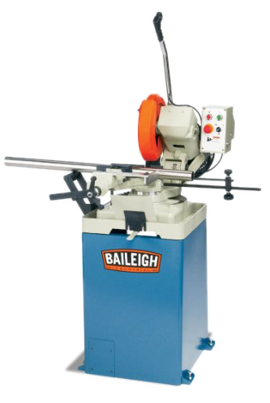

# Cold Saw

{ align="right" width="200px" }

## About

The cold saw is used to make precise cuts in metal. Its toothed blade operates at low RPM to keep the material cool, making it ideal for cutting pipes, rods, and other metals without overheating.

## Setup

- Clamp the piece firmly in the saw’s vice to prevent movement.
- Adjust Angle, if needed. Set the cutting angle if making angled cuts. Use the machine’s adjustment scale for accuracy.
- Make sure the machine is on and the coolant system is enabled. Confirm that the coolant system functions by pulling the trigger for several seconds.

## Usage

- Power on the cold saw with the button on the handle.
- Slowly bring the blade down to the workpiece.
- Apply steady, even pressure throughout the cut—avoid forcing the blade.Press the red stop button when finished.
- Turn off the machine by letting go of the button on the handle after the cut is complete.

## Cleanup

- Sweep or vacuum metal shavings and debris.
- Place any used tools or accessories back in their original location.

## Troubleshooting

| Issue | Action |
| ----- | ------ |
| Blade stops mid-cut | Check that the material is firmly clamped, and ensure the blade is sharp and secured tightly. |
| Excessive heat | Confirm coolant is functioning, and avoid forcing the blade through the material. |
| Excessive noise | Check blade for alignment. Some geometry is more lightly to resonate, even under an ideal setup. |

## Safety Guidelines

| Symbol | Description |
| ------ | ----------- |
| { width="40px" } | Closed-Toe Shoes   **Required** |
| { width="40px" } | Eye Protection   **Required** |
| { width="40px" } | Hearing Protection   **As Needed** |
| { width="40px" } | Tie Back Long Hair / Loose Clothes   **Required** |
| { width="40px" } | **Do NOT**   Wear Gloves! |

- Secure material: the workpiece must be clamped securely to prevent movement.
- Check blade sharpness: Use a sharp, undamaged blade to avoid accidents.
- Keep hands away from the blade and work area during operation.
- Allow the blade to come to a complete stop before adjusting or removing the workpiece.
