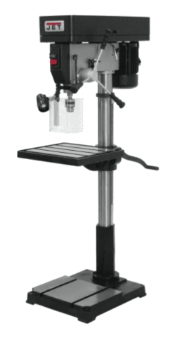

# Drill Press

{ align="right" width="150px" }

## About

The drill press is used to bore holes in parts in a rigid and predictable manner. It is composed of a stand, adjustable table, drill chuck, chuck key, speed adjustment, power buttons, quill, and feed wheel.

## Setup

- Install desired bit in the drill chuck and tighten with the chuck key.
- Remove the chuck key!
- Drill bit flutes should be fully exposed - only tighten around the rounded end of the bit. Leave around 1/4in. of the rounded end exposed.
- Clamp the part to the table using vise, vise grips, C-clamps, or similar.
- If needed, use scrap wood beneath the part to prevent drilling into the table.

!!! warning "Safety Note"
    NEVER leave the chuck key in the drill chuck! The drill press will start anyway, and the key can be thrown violently out, likely into you.

## Usage

- Press the green power button to start the drill press.
- Lower the drill slowly into the part and apply moderate pressure.
  - When drilling through thick material (1/4" or more), periodically retract to clear chips from drill bit flutes.
  - Use cutting fluid when drilling through steel or thick aluminum.
- If needed, adjust the spindle speed. Some machines must be off to change the gearing (inside the top compartment), others should *only when the drill press is on!*
- Press the red stop button when finished.

## Cleanup

- Sweep or vacuum chips and debris for the next user.
- Return bit to original location.

## Troubleshooting

| Issue | Action |
| ----- | ------ |
| Drill bit stops spinning | Ensure the drill bit is tightened in the chuck sufficiently. |
| Drill bit creates smoke | Ensure bit is sharp. (If it is not, throw it away).   Use cutting fluid for steel or thick (>1/8") aluminum.   Back out periodically to clear flutes. |
| Part breaks loose / starts spinning with bit | Ensure part is tightly clamped to the table |

## Safety Guidelines

| Symbol | Description |
| ------ | ----------- |
| { width="40px" } | Closed-Toe Shoes   **Required** |
| { width="40px" } | Eye Protection   **Required** |
| { width="40px" } | Hearing Protection   **As Needed** |
| { width="40px" } | Tie Back Long Hair / Loose Clothes   **Required** |
| { width="40px" } | **Do NOT**   Wear Gloves! |

- Part must be rigidly secured to the table.
- The bit should be tightly fastened and concentric.
- Remove the chuck key before powering on.
- Keep hands away from the drill bit and part while the machine is powered.
- Wait for all motion to cease before manipulating chuck or part.
