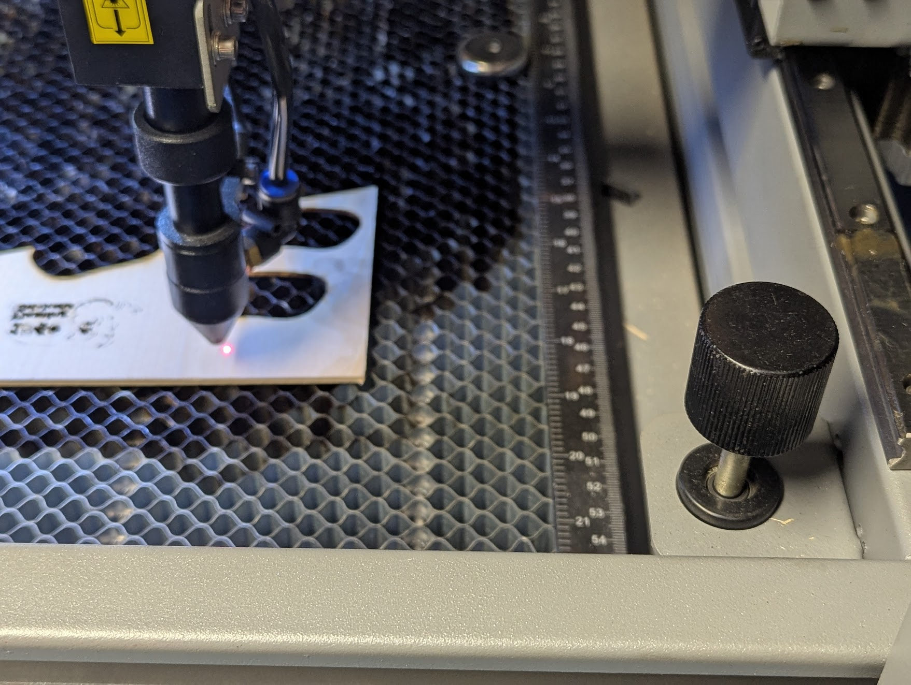

# Laser Cutter

## About

The laser cutter is used to burn through sheet material using a high-power, long wavelength (IR) laser mounted on an XY gantry. Our laser cutter is a mid-range Omtech 100 watt unit capable of 600 mm/s travel speeds.

## Setup

- **Find the material you want.** For this particular project, we will use 1/4" thick Baltic Birch. This high-quality wood has few voids and knots, and the consistent density helps when applying a constant power to cut through the material.
!!! warning
    Not all materials are able to be cut on the laser cutter, as they can be dangerous. Be sure to refer to the [allowable materials](../equipment/laser_cutter_materials.md) list if you are unsure.
- **Power on the machine.** Make sure the laser cutter is powered on. The front panel allows you to move the head around as well as run files from a USB drive, but we won't use any features for this tutorial.
!!! note
    The laser cutter ventilation fan and water chiller are both powered in tandem with the cutter. If you notice the machine is on but either of these critical components is off, get help and **do not proceed**!
- **Set table height.** The laser is focused to a specific point below the head. We use a 3d printed stick to align the top of middle ridge of the laser head with the top of the material, as shown. If the target is too close or too far away, the laser power is focused on a larger area and is usually unable to cut cleanly, if at all, through the material.    The height is adjusted manually with the knob on the front right of the bed.
{ width="45%" } { width="45%" }

## Usage

### Transfer Design

1. Export your DXF file from Onshape
    - Select the **face** of your part
    - Right-click and choose **Export as DXF/DWG...**
    !!! warning "Not letting you export?"
        Ensure you have a face selected while exporting.

    

2. Import DXF into Lightburn

    !!! note
        If your design appears very small, your units are likely set to millimeters. Multiply the width/height by 25.4 to scale to inches.

    

### Configuring Lightburn

1. Separate Inner and Outer Cuts with Colors
    - Use one color for **internal features** (like holes or text).
    - Use a different color for **the outer shape**.
    If the inner layer is not at the top of the layer stack, drag it to the top to ensure it is cut first.

    

2. Assign Speed, Power, and Mode for Each Layer

    - Select each layer from the **Cuts/Layers** window.
    - Set the **speed** (how fast the laser moves) and **power** (how intense the laser is).

    !!! note
        The correct settings depend on your material. Refer to the [speed and power table](/fabrication/equipment/laser_cutter/#speed-and-power) for tested values.

    

### Connect to Machine

1. Connect USB cable
    Plug the USB cable from the laser cutter into your computer. If your laptop lacks a standard USB port, adapters are available.

2. Frame your design on the material
    !!! warning
        The small red laser dot is a nominal marker and does **NOT** correspond precisely with the actual invisible IR laser. The *real* laser is perfectly aligned with the lens on the gantry, and may be slightly forward or behind the red dot.

3. Adjust placement as needed
    If your design is not aligned correctly on the material:
    - Move the material on the bed, **or**
    - Reposition the design within Lightburn  

    Then re-run the frame process until everything lines up as expected.

### Start Cut

Once you have followed all of the instructions, you are ready to go! Press "Start", sit back, and relax while the laser cutter does all the hard work!

!!! warning "Never leave the machine unattended!"
    The laser cutter is one of several automated machines that **CAN** malfunction. When some machines malfunction, they just break the part or tool and no harm is done, egos aside. The laser cutter, however, has the potential to catch fire :fire:. There is a dedicated fire extinguisher by the machine. Always be aware of its location before starting a cut, and be prepared to use it. :fire_extinguisher:

### Cleanup

After your cut is complete, it's important to leave the laser cutter and Annex clean and ready for the next user.

1. Remove your finished material
    - Be sure to collect any small pieces that may have fallen through or been left behind.
2. Clear leftover scraps and debris
    - Remove any small bits of material, charred pieces, or dust.
3. Return tools and accessories
    - Put the focusing tool, USB cables, and any other borrowed tools back in their designated spots.
    - If you used tape or magnets to hold down material, return them to the Annex area.

## Speed and Power

| Material | Speed | Power | Notes |
| ----- | ------ | ----- | ------ |
| 0.2" MAXComposite | 0.23in/s | 90% | |
| 0.1" MAXComposite | 0.29in/s | 90% |  |
| 1/4" Baltic Birch Plywood | 0.20in/s | 40% |  |
| 1/8" Baltic Birch Plywood | 1.30in/s | 30% |  |
| Baltic Birch Plywood engraving, fill | 20in/s | 30% | 1 pass, unidirectional fill |
| Baltic Birch Plywood engraving, image | 10in/s | 30% | 10% min power, 1 pass, unidirectional fill |

## Troubleshooting

| Issue | Action |
| ----- | ------ |
|  |  |
|  |  |
|  |  |

## Machine-Specific Safety Guidelines

- todo
