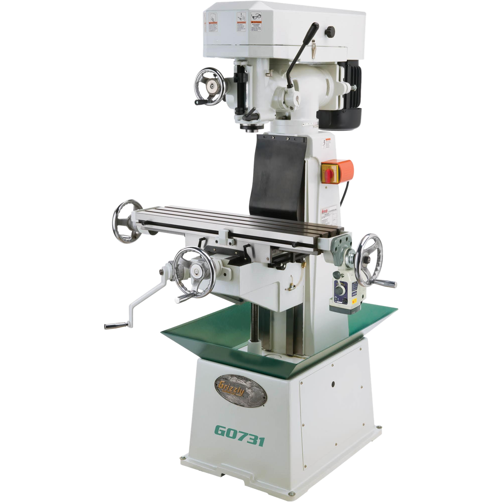

# Manual Mill

{ align="right" width="200px" }

## About

A manual mill, or milling machine, is used to precisely machine parts by removing material. It can cut various materials, especially metals, and is commonly used for shaping, drilling, and slotting.

## Setup

- Choose the correct end mill, drill bit, or cutting tool for the task and material.
- Place the tool in the spindle and secure it using the appropriate chuck or collet. Tighten with a wrench as needed.
- Secure the workpiece firmly to the table using a vice, clamps, or a fixture.
- Zero your X and Y positions based on the reference points of the workpiece.

!!! tip "DRO"
    Our JET mill is equipped with a DRO, or digital read-out, which provides an indicator on where the X and Y axes are with high accuracy. There is no Z position, though!

## Usage

- Power on the mill and set the spindle to the correct speed for the material and tool size.
- Bring the tool into contact with the workpiece, advancing slowly and carefully to avoid sudden impact.
- Use the hand wheels to control the movement and feed rate, applying steady pressure.
- Periodically stop to clear chips and debris from the cutting area. Use an air blower or brush - **never** use hands, since there are often sharp metal splinters.
- Apply cutting fluid if required, especially for thicker metal or steel, to reduce heat and friction.
- Turn off the machine once the operation is complete and wait for the spindle to come to a full stop.

## Cleanup

- Sweep or vacuum chips and debris for the next user.
- Return end mills, bits, and accessories to their proper location.
- Wipe down the mill table, vise, and any surfaces with chips or coolant residue.

## Troubleshooting

| Issue | Action |
| ----- | ------ |
| Tool or part chatters | Ensure the tool is secured tightly, adjust feed rate or reduce speed, and check that the workpiece is properly clamped. |
| Poor finish | Check that the cutting tool is sharp and appropriate for the material. Adjust speed and feed rate as needed. |
| Excessive heat / smoking | Reduce speed, apply cutting fluid, or take lighter cuts to avoid overheating the tool and material. |

## Safety Guidelines

| Symbol | Description |
| ------ | ----------- |
| { width="40px" } | Closed-Toe Shoes   **Required** |
| { width="40px" } | Eye Protection   **Required** |
| { width="40px" } | Hearing Protection   **As Needed** |
| { width="40px" } | Tie Back Long Hair / Loose Clothes   **Required** |

- Ensure the workpiece is clamped firmly to prevent movement during milling.
- Use sharp, appropriate tools to improve finish and safety.
- Keep hands and body parts away from the rotating tool and cutting area.
- Allow the spindle to come to a complete stop before adjusting or removing the workpiece.
