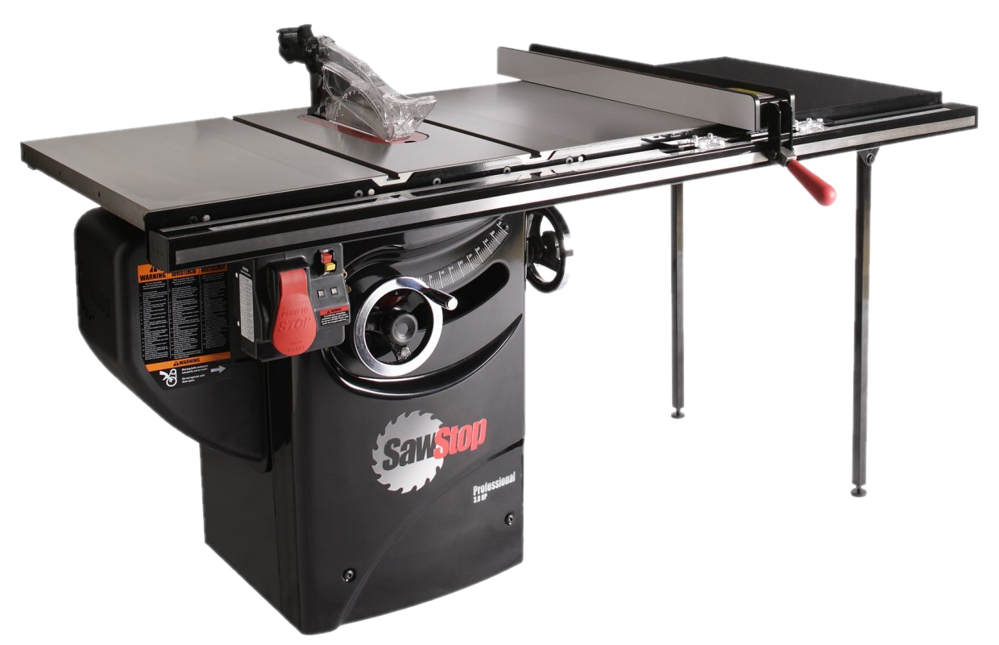

# Table Saw

{ align="right" width="250px" }

## About

A table saw is used to make straight cuts in wood and other materials by moving the workpiece through a rotating blade. It is ideal for ripping boards, cross-cutting, and making precise angled cuts.

The saw in the Outback is a [SawStop](https://www.sawstop.com/), which can detect the presense of flesh such as a hand or finger and *instantly* (within milliseconds) snap the blade back to prevent injury. This feature does come at a price, about $150 and 30 minutes per event, as it damages the safety mechanism and blade in the process.

!!! warning "Safety Note"
    The table saw is one of the most dangerous tools in any shop. You **MUST** have an adult supervise work on the table saw.

## Setup

- Select a blade appropriate for the material and cut type (e.g., rip, crosscut, rough or finish, etc).
- Ensure the blade is securely installed and aligned correctly, with the teeth pointing toward the front of the saw.
- Adjust the blade height so it’s just above the material thickness, typically about 1/4in. higher than the material.
- Use the fence for rip cuts or the miter gauge for crosscuts to guide the workpiece accurately.
- Ensure clearance around the tool before, during, and after the cut.
- Make sure the vacuum is attached and not full before starting.

!!! note "Materials"
    Our SawStop uses a capacitive sensor, similar to a touchscreen, to sense whether flesh is in contact with the conductive metal blade. That also means that any conductive materials like metal, some plastics, wet wood, and carbon fiber can also trigger the safety mechanism.

    Adults are needed to cut any of these materials, as they require the internal safety mechanism to be disabled.

## Usage

- Turn on the table saw.
  - We have a SawStop, which needs to calibrate the saw capacitance on startup. Flip the yellow switch and wait for the red light to stop flashing.
- Power the table saw, allowing the blade to reach full speed before starting the cut.
  - The vacuum should also start when the table saw is powered.
- Hold the workpiece firmly against the fence or miter gauge, and push it slowly and steadily through the blade.
- For cuts where your hands would be near the blade, use push sticks or push blocks to keep a safe distance.
- Keep the workpiece against the fence or gauge throughout the cut. Avoid twisting or angling it mid-cut to prevent kickback.
  - Push the piece completely past the blade to prevent kickback. Have someone else catch the piece if needed as it exits the back of the table.
- Turn off the table saw and wait for the blade to stop completely before retrieving the workpiece.

!!! warning "Safety Note"
    While our machine *does* prevent the blade from touching you directly, the table saw is still dangerous. The easiest way to hurt yourself is with kickback, where the blade catches on the part and lauches it up or back at your with extreme power. Avoid cross cuts where possible (use the miter saw for this), and always cut straight using the fench as a guide.

## Cleanup

- Clear sawdust and scrap material from the table and surrounding area.
- Return push sticks, blocks, and other accessories to their storage area.
- Ensure the blade is clean and ready for the next use.
- Stow the blade if it is not going to be used imminently.

## Troubleshooting

| Issue | Action |
| ----- | ------ |
| Workpiece hops up and down while cutting | Usually this is because the part is too thin or is not held down firmly near the blade. |
| Vacuum does not start | Ensure the "auto" button is selected on the switch near the vacuum. |
| Saw does not start | Make sure the red light is not flashing. If it is, power off and on the table and wait for the light to stop flashing. |

## Safety Guidelines

| Symbol | Description |
| ------ | ----------- |
| { width="40px" } | Closed-Toe Shoes   **Required** |
| { width="40px" } | Eye Protection   **Required** |
| { width="40px" } | Hearing Protection   **As Needed** |
| { width="40px" } | Tie Back Long Hair / Loose Clothes   **Required** |
| { width="40px" } | **Do NOT**   Wear Gloves! |

- Always keep the workpiece securely against the fence or miter gauge.
- When hands would be near the blade, use push sticks or blocks to guide the workpiece.
- Keep hands well clear of the blade path. Stand slightly to the side, not directly behind the blade, to avoid kickback.
- Allow the blade to come to a full stop before removing the workpiece or adjusting the setup.
