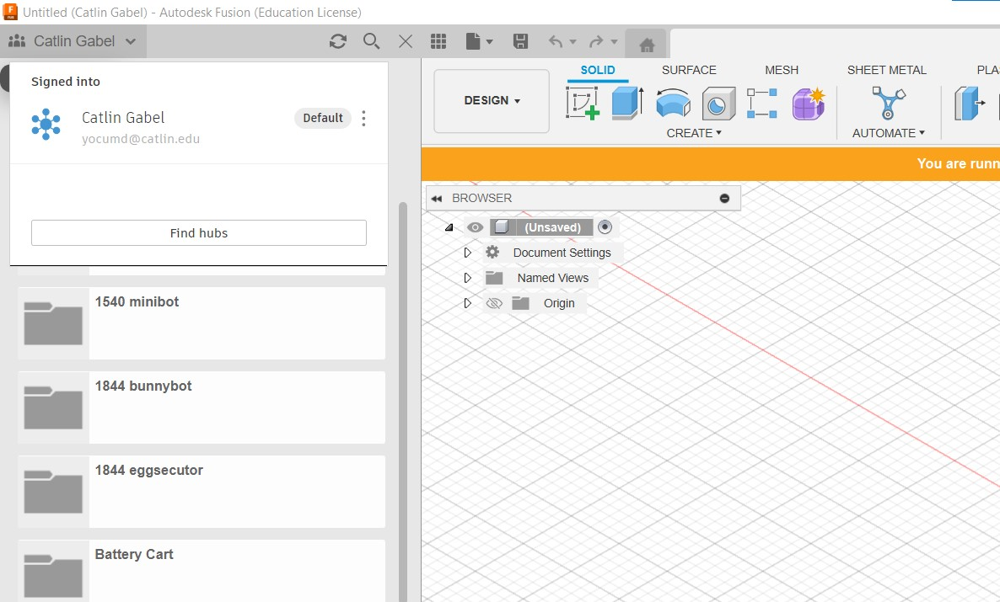

# Fusion 360

{ width="100" align="left" }
Fusion360 is an all-in-one CAD/CAM solution from Autodesk.
While you can model and simulate as well, we use Fusion specifically for CAM.
Fusion is a cross-platform application that requires an internet connection, as all files are stored on the cloud.

## Setup

### Account Setup

If you don't yet have Fusion installed, you must first select the education version of Fusion and create an Autodesk account using your school email:

<https://www.autodesk.com/education/edu-software/overview#FSN>

Select *Student*, then fill in the required information using your school email. Autodesk, like many software vendors providing free access to students, require that your email end in `.edu`.

Finally, contact Kevin to get access our [Autodesk team workspace](https://catlin2.autodesk360.com/). This is where all of our CAM files (and prior projects) are stored, along with any shared machines, tools, and template operations.

### Installation

Download and install Fusion from the page above. This can also be found from the downloads section when logged into the Autodesk website.

There are two quick steps after installation:

1. Change the account in the top-left corner to "Catlin Gabel Engineering":

    
    /// caption
    Select the drop-down in the top-left corner and choose "Catlin Gabel Engineering". This allows you to save projects and load files from our shared server.
    ///  

2. Enable Cloud Libraries in the Manufacture tab. Select the user icon in the top right, then `Preferences`, and under the `Manufacture` settings make sure `Enable Cloud Libraries` is checked:

    
    /// caption
    (1) First open `Preferences` under your account, then (2) select `Manufacture` on the left, and finally (3) `Enable Cloud Libraries`.
    ///

You're now ready to prepare a file for a CNC machine, like the ShopBot router or Tormach mill! Check out the tutorials below to get started.

## Tutorials

- (todo) [Router Plate Tutorial](tutorials/shopbot_plate_tutorial_part1.md)
- (todo) [Tormach Simple Plate Aluminum Tutorial](tutorials/tormach_simple_plate_tutorial.md)
- (todo) [Tormach Advanced Plate Aluminum Tutorial](tutorials/tormach_advanced_plate_tutorial.md)
- (todo) [Tormach 3D Contour Tutorial](tutorials/tormach_3d_tutorial.md)

