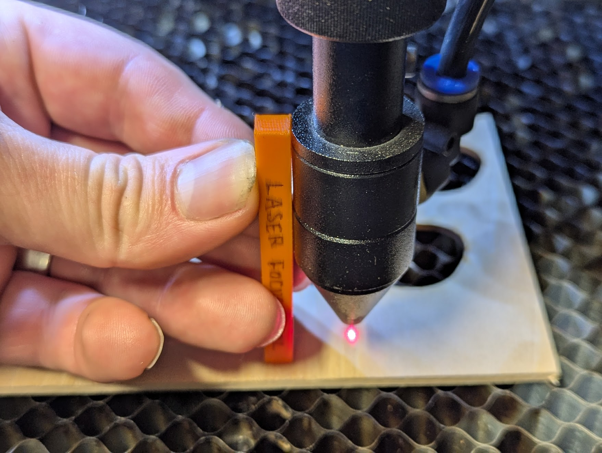

# Laser Cutter Tutorial

Current Status: `Outlined`

## Objective

Lasercutters are planer gantry machines that use a high power laser to burn through material. Most modern machines are CNC and use software to translate a 2D design into instructions to automatically move a head along an XY gantry.

In this tutorial, we will:

- Learn the process to setup and clean up the [Omtech 100 Watt laser cutter](../equipment/laser_cutter.md) in the Outback.
- Create a nametag you can wear around town.
- Do all of the above without burning down the building :fire: or suffocating on toxic fumes :material-smoke:.

## Procedure

### Install Lightburn

{ width="120px" align="right" }
Lightburn is a design and control software used to operate laser cutters. It allows users to import vector and image files, adjust settings like power and speed, and organize cut and engrave layers. Lightburn is widely used in engineering and fabrication labs due to its precision, compatibility with many machines, and intuitive interface for both beginners and advanced users. 

1. To get started with laser cutting, you'll need to install [Lightburn](https://lightburnsoftware.com/), the software we’ll use to prepare and send your design files to the laser cutter.  

2. Once installed, you can begin a **free trial** of Lightburn.

!!! note
    Lightburn allows multiple trial extensions, often lasting you several months. If you ever run out, Kevin has extra keys available.

### Design your Name Tag

Design your name tag in Onshape.

We recommend starting from this [example project](https://cad.onshape.com/documents/03d6037b25f260e68733c332/w/bec18e5b73356748df04d15f/e/f3d44ad77acdb351dc18acb9). You can copy it and make modifications—change the shape, add your name, or include a small graphic.

### Transfer Design

1. Export your DXF file from Onshape
    - Select the **face** of your name tag  
    - Right-click and choose **Export as DXF/DWG...**
    !!! warning "Not letting you export?"
        Ensure you have a face selected while exporting.

    

2. Import DXF into Lightburn

    !!! note
        If your design is unreasonably small, it is likely that your units are set to millimeters. You can multiply either the width/height by 25.4 to scale to inches.

    

### Configuring Lightburn

1. Assign differing colors for inner and outer lines.
    !!! note "Why this is important"
        If the outer gets cut before all of the inner, it is possible for the material to shift, misaligning critical features.
    

2. Set each colors speeds and power. Refer to the 

 

### Machine Setup

- **Find the material you want.** For this particular project, we will use 1/4" thick Baltic Birch. This high-quality wood has few voids and knots, and the consistent density helps when applying a constant power to cut through the material.
- **Power on the machine.** Make sure the laser cutter is powered on. The front panel allows you to move the head around as well as run files from a USB drive, but we won't use any features for this tutorial.
!!! note
    The laser cutter ventilation fan and water chiller are both powered in tandem with the cutter. If you notice the machine is on but either of these critical components is off, get help and **do not proceed**!
- **Set table height.** The laser is focused to a specific point below the head. We use a 3d printed stick to align the top of middle ridge of the laser head with the top of the material, as shown. If the target is too close or too far away, the laser power is focused on a larger area and is usually unable to cut cleanly, if at all, through the material.    The height is adjusted manually with the knob on the front right of the bed.
{ width="45%" } { width="45%" }

### Connect to Machine

Connect USB cable.

### Verify Cut

Run a preview cut to make sure the laser does not leave the material border.

!!! note
    The small red laser dot is a nominal marker and does **NOT** correspond precisely with the actual invisible IR laser. The *real* laser is perfectly aligned with the lens on the gantry, and may be slightly forward or behind the red dot.

### Go

Hit go, sit back, and relax while the laser cutter does all the hard work!

!!! warning "Never leave the machine unattended!"
    The laser cutter is one of several automated machines that **CAN** malfunction. When some machines malfunction, they just break the part or tool and no harm is done, egos aside. The laser cutter, however, has the potential to catch fire :fire:. There is a dedicated fire extinguisher by the machine. Always be aware of its location before starting a cut, and be prepared to use it. :fire_extinguisher:

### Cleanup

Take material off the bed.

Make sure the bed is level and clear of small debris that might have fallen out.

## Takeaway

Congratulations! :tada: You are now ready to make anything you want on the laser cutter.

Always check the [allowable materials](../equipment/laser_cutter_materials.md) if you are unsure, as some plastics do not cut well or off-gas toxic fumes, such as PVC or polycarbonate

### Further Reading

- todo Design references/tutorial
- [Laser cutter reference page](../equipment/laser_cutter.md)
- [Permitted laser cutter materials](../equipment/laser_cutter_materials.md)
