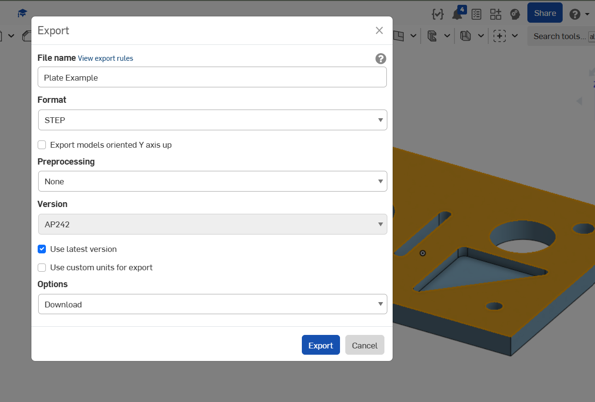
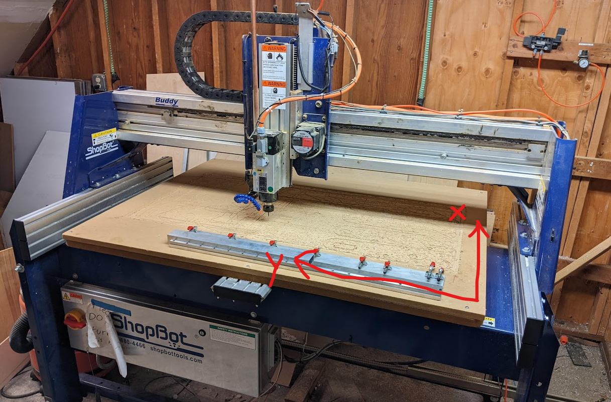

# CNC Router Tutorial: Part 1

The [CNC router](../equipment/cnc_router.md) is a fast, 3-dimensional automated machining tool. While CNC routers are geared primarily for machining softer materials like wood or plastics, they are still capable of machining aluminum or steel with the right settings.

This tutorial is split into two parts:

1. [Part 1](shopbot_plate_tutorial_part1.md): (this page) Process a CAM file to prepare it for the router.
2. [Part 2](shopbot_plate_tutorial_part2.md): Machine a part on the router using our generated `.sbp` files.

## Objective

The goal of this two-part tutorial is to:

1. Provide a high-level overview of the CAM process.
2. Teach safe router setup practices.
3. Show the full and complete process to translate 3d models of plate designs into physical parts, to avoid confusion and to function as a reference manual.
4. Make a part out of aluminum!

## Steps

Preparing a part for routing requires the following steps:

1. Import the file into Fusion
2. Create a part setup
3. Add machining operations to carve out material
4. Simulate the operations and toolpath
5. Export the toolpath as a file for our machine

### 1. Import File

Make sure you have Fusion installed and an account setup within our workspace.

Download a 3D model of the part you want to make. We typically use `STEP/STP` or `IGES` files, as they are an open, non-proprietary formats that work across most modeling programs.

??? note "About 3D file types"
    3D model files usually come in two flavors: mesh and NURBS.

    [Mesh files](https://en.wikipedia.org/wiki/Polygon_mesh) define geometry with triangles and points, including arcs and curvature. They are typically larger and have visible edges and faces, depending on the resolution or fidelity. They work well for artistic modeling or surface modeling, where deviations and imperfections are desirable and hard to define with mathematical precision. Examples of mesh files are Object (`.OBJ`) or Stereolithography (`.STL`), commonly found in 3D modeling for games/computer graphics or 3D printing.

    [NURBS (Non-Uniform Rational B-Splines)](https://en.wikipedia.org/wiki/Non-uniform_rational_B-spline), on the other hand, are equations to define these complex shapes. Without triangles and polygons, formats using NURBS don't suffer from scaling issues or quantizing effects on curves. Most CAD formats, such as `.STEP`, `.IGES`, `.SLDPRT`, etc, utilize these splines.

You can use whatever file you'd like for this tutorial. However, you should find a file that is:

- A specific thickness throughout that matches material on hand. That would be 1/16in. (0.0625in), 1/8in. (0.125in), or 1/4in (0.25in).
- Not too big or small - a few inches on each side is perfect
- Contains holes in the middle that are no smaller than the router bit we typically use (4mm diameter).

[Here is an example part](https://cad.onshape.com/documents/97b41e1c7d9ace2be4cb3ffe/w/7d7c9a33a778e83815b2a6d4/e/390453226c11883589e02a2e?renderMode=0&uiState=683ba7074301342ffe6da70f). To download from OnShape, right-click or two-finger-click on the part and select `Export`, then under `Format` select `STEP` and give it a name. The file should download automatically in a few seconds.

Once you have a file on hand, the first step is to import it into Fusion. Open with `File`/`Open` or with ++ctrl+o++ (Windows) or ++cmd+o++ (Mac), then select `Open on My Computer` and select your file.

The file needs to be saved in a Fusion project before continuing. We store files within project folders in the shared Fusion space. Hit ++ctrl+s++ (Windows) or ++cmd+s++ (Mac) and select a project folder to save in.

### 2. Setup

We are now ready to create a setup!

A **setup** defines the *orientation* of the part along with the *stock*, or the initial material to cut from.

First, switch from `Design` to `Manufacture`, then select the `Setup` button in the ribbon to create a new setup.

??? example "Video Walkthrough"
    

A transparent yellow box surrounds the part, representing our stock material. We'll first reorient the part, then set the stock.

!!! tip "Fusion Tooltips"
    Fusion has excellent documentation built-in. Just hover over a field or button for a couple seconds and a very descriptive tool-tip will appear, usually with a picture in tow.

Most machines orient parts such that the X and Y axes form the horizontal plane, like graph paper, while the Z axis extends up in the positive direction from that plane.

The X-axis on our ShopBot is actually along the short axis, as shown:

{ width="75%" }

As long as you know where the part is zeroed, you can select any point as the "origin". However, our router has an automated Z zeroing feature to the top of the stock material.

1. Select `X & Y Axes` under `Orientation`, then pick an edge that is aligned with the X-axis and another oriented at a 90 deg. angle for the Y-axis.
    - You may need to flip them so that the Z-axis is pointing upward.
    - You can reorient the part with the gimbal in the top-right corner.
2. Next, select the box point placing the coordinate system on top of the part so the bulk of the part extends out along the positive X and Y axis.
3. Finally, switch to the `Stock` tab and adjust the offsets to `0 in` for Top, `0 in` for Side, and something small for Bottom like `0.030 in`.
    - This will ensure the tool cuts through the stock material and into the wooden spoilboard beneath it.
4. Hit `OK` on the setup dialog to wrap up.

??? question "What if there are no edges aligned with the X or Y axis?"
    If you have a part with curved edges or it's situated at an odd angle from the principal axes, you might need to use a sketch to define the X and Y axis.

    To do this, switch back from `Manufacture` to `Design`, then `Create Sketch` and draw two lines 90 degrees apart on the desired top face of the part. Switch back to `Manufacture`, and you should then be able to select your sketch lines in the `Setup` dialog.

??? example "Video Walkthrough"
    

### 3. Machining Operations

Now that Fusion knows our part orientation and stock, we can start adding in the machining operations. When routing parts, we will remove material and separate the part from the bulk sheet. We generally do this in two steps:

1. Machine **inner** geometry: holes, slots, pockets
2. Machine the **outer** boundary or perimeter of the part

We have to pause between the operations to fasten the part to the spoilboard, since it could go flying or break the tool if it becomes loose once separated.

The actual operations we can perform are listed under the `2D` and `Drilling` sections in the top ribbon. Hover over the operations in Fusion to show an example and description. Here are some of the important ones:

- **2D Pocket**: Removes a lot of material from an arbitrary shape, either completely through or at a specific Z (vertical) distance
  - **2D Adaptive Pocket**: This is a special type of pocket that tries to reduce the force on the cutting tool. This is typically not necessary.
- **Slot**: cuts back and forth along a line to create a slot
- **2D Contour**: Cuts along a closed shape, like the perimeter of a part
- **Bore**: boring is the action of forming a hole, so the Bore operation is a special type of 2D Contour that just moves in a circular (or helical) path
- **Drilling**: Mimic a [drill press](../equipment/drill_press.md) by driving straight down into the material, with the expectation that a drill bit is installed in the machine.  

!!! tip "Template Operations"
    An awful lot of information is contained within each operation. Tool size, speeds, coolant, lead-in and lead-out, geometry to machine, etc.

    You *can* define each operation in full, but this becomes incredibly tedious if parameters need to be repeated. Plus, we've already determined some good starting points for you!
    
    So, we will be using a *template* to speed up the process.

#### 3.1 Template Library

Let's begin by adding some default operations. From `Manage`, select `Template Library`. In the dialog, navigate to `My Templates` / `Cloud` / `Router` and select the template for your material, such as `Plate - Aluminum`. Then press the top-left button above to add them to your file. Close the dialog when finished.

??? example "Video Walkthrough"
    

Some default operations should now be listed on the left under `Setup 1`. We will go through these one-by-one in the next sections.

Our final operation will be a 2D Contour, so we will start with the rest as our inner operations.

#### 3.2 Inner Operations

Double-click on `Bore` in the browser tree on the left. Our template operations have the correct tool selected (4mm single-flute end mill), but we need to update the geometry, since the template does not know where these operations should apply on our specific part.

Unlike `2D Pocket`, a `Bore` operation only follows a single path. That means the holes we select cannot be more than twice the diameter of our tool. With a 4mm tool, we can't cut less than 4mm (0.157in) or greater than 8mm (0.315in).

Select `Circular Face Selection`, then click on all of the smaller holes that fit the bill. We'll leave the larger holes for `2D Pocket`.

??? tip "Too many holes?"
    If you have more holes to bore than you care to select, check `Select Same Diameter`, *et voila*, all of the holes matching the ones selected will be included in the toolpath!

??? example "Video Walkthrough"
    

Repeat this process for `2D Pocket` and `Slot`, deleting the missing geometry and selecting the appropriate new geometry for each. For blind pockets or features that only extend partway into the material, you will need to select the bottom contour so the operation knows how far down to machine.

You can delete `2D Adaptive Pocket`, since we won't be using it here.

!!! note
    Each operation wants slightly different geometry. Drills and Bores want cylindrical faces, while contours want a closed edge. Pockets will accept edges or bottom faces.

??? example "Video Walkthrough"
    

#### 3.3 Outer Operation

The last operation to add is the `2D Contour` to cut the part out. Repeat the process above, first removing the existing outline geometry, then selecting the new outline. You can select the top or bottom edge - this operation just needs the shape, and will use the stock thickness information to determine the cutting depth.

??? tip "Cutting many parts?"
    Use the `Silhouette` tool in the Geometry selector to quickly select all of the outer contours of your parts. This is especially helpful when machining many small or repeated parts, such as aluminum gussets.

??? example "Video Walkthrough"
    

We are now ready to simulate and export!

### 4. Simulation

It is *always* a good idea to simulate your toolpath before running it on the machine, since small mistakes can be costly with subtractive processes like routing.

Make sure `Setup` is selected in the browser so all operations are simulated, then hit `Simulate` under the `Actions` section. The simulation steps through the toolpath, removing a virtual stock just as the real router would. You can adjust the simulation speed, pause, and even rewind or jump ahead using the trackbar at the bottom.

??? question "What if I cannot see the toolpath or stock?"
    Sometimes the visualization settings aren't quite right.
    With the `Simulate` dialog open, check that:

        - `Toolpath` is checked
        - `Stock` is checked, and transparent is unchecked
        - `Model` opacity is around 50%

??? example "Video Walkthrough"
    

In this example, we can see the triangular pocket was cut through the whole part! Whoops. Let's fix that by moving the triangle to its own `2D Pocket` operation. Close the simulation dialog, then right-click or two-finger-click on the `2D Pocket` op and select `Duplicate`. Edit the first `2D Pocket` to remove the triangle. Then, edit the second `2D Pocket` to remove the holes, and under the `Heights` tab, adjust the `Bottom` selection to be the selected contour rather than the stock bottom.

Run the simulation again to confirm the fix.

??? example "Video Walkthrough"
    

Our toolpath is ready for prime-time! The final step is to export our files for the router. Be sure to save your changes (++ctrl+s++ (Windows) / ++cmd+s++ (Mac)).

### 5. Export (Postprocess)

We've created a toolpath defining the position, speed (feedrate), and spindle velocity (rpm) to machine our part, but we need to translate that generalized toolpath into a language our router understands. Most CNC machines use [G-code](https://en.wikipedia.org/wiki/G-code), but even the specifics will differ between vendors and machines based on supported features. The tool we use to generate that G-code is a post-processor.

Our Autodesk cloud space includes not just tools, templates, and projects, but machines and their post-processors. All we have to do is define which operations to export for each of our two files (inner and outer).

Choose `NC Program`, right next to the `Setup` icon. In the dialog, select the dropdown under `Machine and Post` and navigate to the `Shopbot Tools` post-processor, then choose an output directory and give a name to the first file. Switch to the `Operations` tab and select every operation except the `2D Contour`. Select `Post` at the bottom to generate the first file.

Repeat this process, giving our second file a different name (perhaps ending with `outer`) and selecting **only** the `2D Contour` operation under the `Operations` tab. Make sure to hit `Post` at the bottom to generate the second file.

??? example "Video Walkthrough"
    

    This example does not include the *second* output, described above.

## Takeaway

Congratulations! :tada: The two generated files ending in `.sbp` from the [post-process step](#5-export-postprocess) above can be used to machine our part.

In this tutorial, we used Fusion and our template operations to generate a toolpath for machining a custom part on our ShopBot router. The process used here is widely applicable for other types of machines, like the CNC mill, and is used by professional shops worldwide.

In the second half linked below, we will actually machine the part.

[Part 2: Cutting the Part](shopbot_plate_tutorial_part2.md){ .md-button }

### Further Reading

- [Official Fusion CAM tutorial (90 mins)](https://www.autodesk.com/learn/ondemand/course/learn-fusion-360-for-cam-in-90-minutes)
